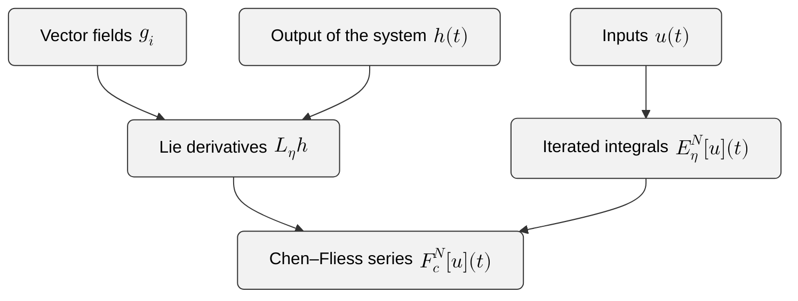
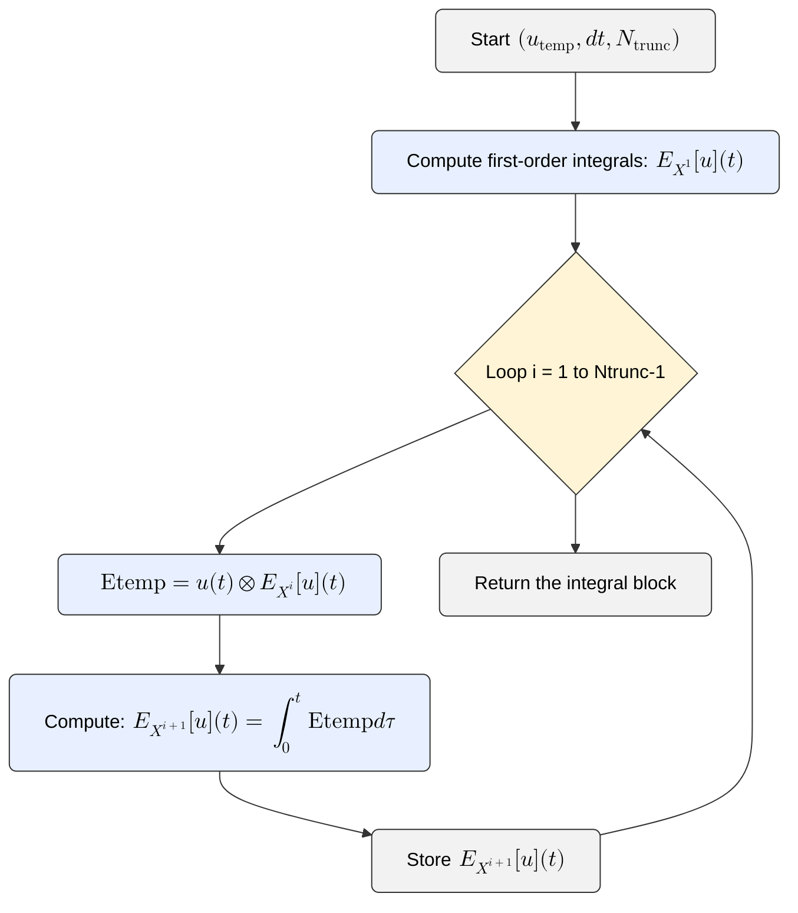
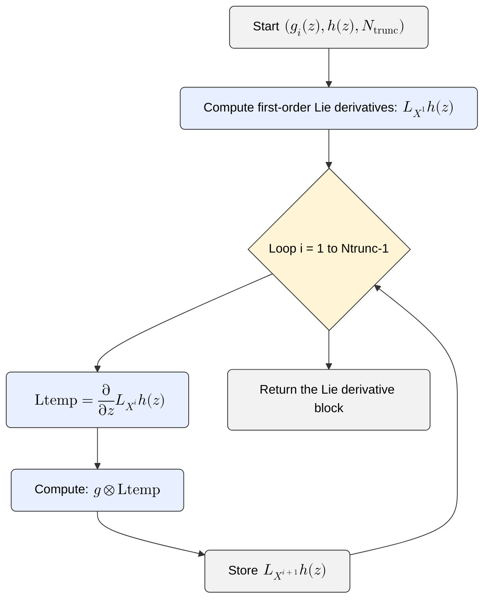

# Getting Started


This chapter provides a high-level overview of how to begin using
**CFSpy**. It introduces the core workflow, explains the
main concepts, and walks through the essential steps for computing
Chen–Fliess expansions in practice.

The goal is to give you a clear mental model first, and then guide you
through concrete examples.

## Content


- [installation](#Installation) 
- [basic usage](#Basic-usage)
- [iterated integrals](#iterated-integrals)
- [vector field](#vector-field)
- [lie derivatives](#lie-derivatives)
- [truncated series](#truncated-series)
- [ode comparison](#ode-comparison)
- [pitfalls](#pitfalls)
- [more examples](#more-examples)


## Installation


To install the **CFSpy** package, run the following command
in your terminal.

```bash
pip install --upgrade CFSpy
```

This will download and install the package along with its dependencies.
Make sure you have Python 3.12.4 or higher installed on your system.


## Basic Usage (High-Level Overview)


Once installed, **CFSpy** enables you to compute the
building blocks of the Chen–Fliess expansion:

1. **Iterated integrals** of the input  
2. **Lie derivatives** of the output along the vector fields  
3. **Chen–Fliess coefficients** $(c,\eta)$  
4. **Truncated Chen–Fliess series** $F_c^{N}[u](t)$  
5. **Comparison with the true system output**

A typical workflow looks like this:




The sections below walk through each step in detail.


## Computing iterated integrals


To compute the iterated integrals $E_\eta[u](t)$,
you must define:

- time interval $[0,t_f]$,
- input function $u(t)$,
- the integration step $dt$.
- truncation length $N$


```python
from CFS import iter_int, iter_lie, single_iter_int, single_iter_lie
import numpy as np

# Time range
t0 = 0
tf = 3
dt = 0.001
t_span = (t0, tf)
t = t0:dt:tf

# inputs as arrays
u1 = sin.(t)
u2 = cos.(t)

# input array
u = np.vstack([u1, u2])

Ntrunc = 4
E = iter_int(utemp, dt, Ntrunc)
```


This computes all iterated integrals $E_\eta[u](t)$ for
$|\eta| \le N$.

The algorithm of the `iter_int` function is based on Chen's identity
which translates numerically to 

```{math}:label:eq-cfs
    \begin{aligned}
    E_{X^k}[u](t)=\int _0^t u(t)\otimes E_{X^{k-1}}[u](t) d\tau .
    \end{aligned}
```

where $u(t)$ is the matrix of inputs stacked horizontally,
$E_{X^k}[u](t)$ is the matrix that stacks horizontally the iterated integrals 
and the tensor symbol $\otimes$ represents 
the [column-wise Kronecker product](https://en.wikipedia.org/wiki/Khatri%E2%80%93Rao_product).

The outline of the calculation of the algorithm follows the workflow:




## Defining vector fields and outputs


To compute Chen–Fliess coefficients $(c,\eta) = L_\eta h$,
you must define:

- the drift vector field $g_0(z)$,
- the controlled vector fields $g_i(z)$,
- the output function $h(z)$.

Example:

```python
using Symbolics

@variables x[1:6]
z_vec = x

Ntrunc = 4

h = x[1]

# parameters
gg     = 9.81   # Gravitational acceleration (m/s^2)
m     = 0.18    # Mass (kg)
Ixx   = 0.00025 # Mass moment of inertia (kg*m^2)
L     = 0.086   # Arm length (m)


g = hcat(
    [x[4], x[5], x[6], 0, -gg, 0],
    [0, 0, 0, 1/m*sin(x[3]), 1/m*cos(x[3]), -L/Ixx],
    [0, 0, 0, 1/m*sin(x[3]), 1/m*cos(x[3]), L/Ixx]
)
```


## Computing Lie derivatives


Lie derivatives encode the geometric structure of the system.

```python
x_val = [0.5, 0.0, 0.1, 0.0, 0.0, 0.0]   # make it Float64 to avoid promotion issues

# initial evaluator for Ntrunc = 4
f_L = build_lie_evaluator(h, g, x_vec, Ntrunc)
L_eval = f_L(x_val)   # Vector{Float64}, no Symbolics anywhere
```

Similarly to the iterated integrals, the outline of the calculation of the algorithm follows the workflow:




## Computing truncated Chen–Fliess series


Once iterated integrals and Lie derivatives are available, you can
assemble the truncated Chen–Fliess series:

```python
Fc = z_val[1] .+ vec(L_eval' * E)  
```

This returns a numerical approximation of

```{math}
F_c^{N}[u](t) = \sum_{|\eta| \le N} (c, \eta)\, E_\eta[u](t).
```


## Comparing with ODE simulation


To validate the approximation, compare it with the true system output.

```python
using DifferentialEquations

function twodquad!(dx, x, p, t)
    # input u1(t)
    u1 = sin(t)          # scalar, t is a Float64 here
    u2 = cos(t)

    # same dynamics as symbolic g, but numeric
    dx[1] = x[4]
    dx[2] = x[5]
    dx[3] = x[6]
    dx[4] = 1/m*sin(x[3])*(u1+u2)
    dx[5] = -gg + (1/m*cos(x[3]))*(u1+u2)
    dx[6] = (L/Ixx)*(u2-u1)
end

x0 = [0.0, 0.0, 0.1, 0.0, 0.0, 0.0]
tspan = (0.0, 0.1)

prob = ODEProblem(twodquad!, x0, tspan)
sol = solve(prob, Tsit5(), saveat = t)

x1_ode = sol[1, :]   # extract x₂(t), since h = x₂

y_true = x1_ode
y_cfs  = Fc
```


## Common pitfalls


- **Mismatched dimensions**: Inputs must have shape $(m+1, length(t))$.
- **Transpose required**: Use $vcat(u0', u1', ...)$.
- **Large truncation depth**: Word count grows combinatorially.
- **Vector fields should be symbolic** for compliance.
- **Indexing inside ODE solvers** must match the time grid.


## More examples


For more detailed examples and advanced usage,
see the [examples](content/Examples.html) of the documentation.