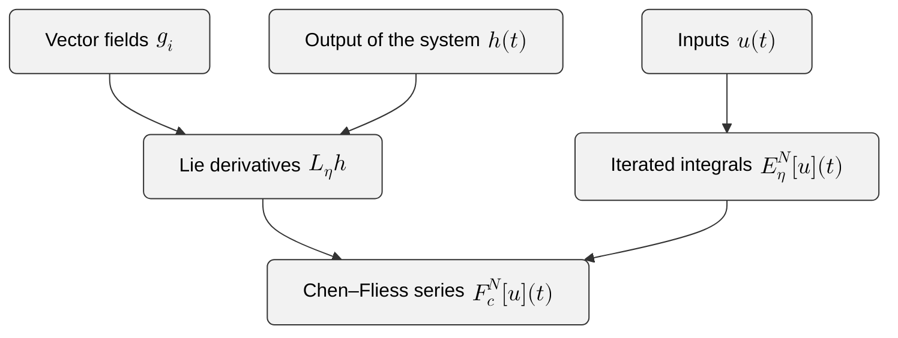
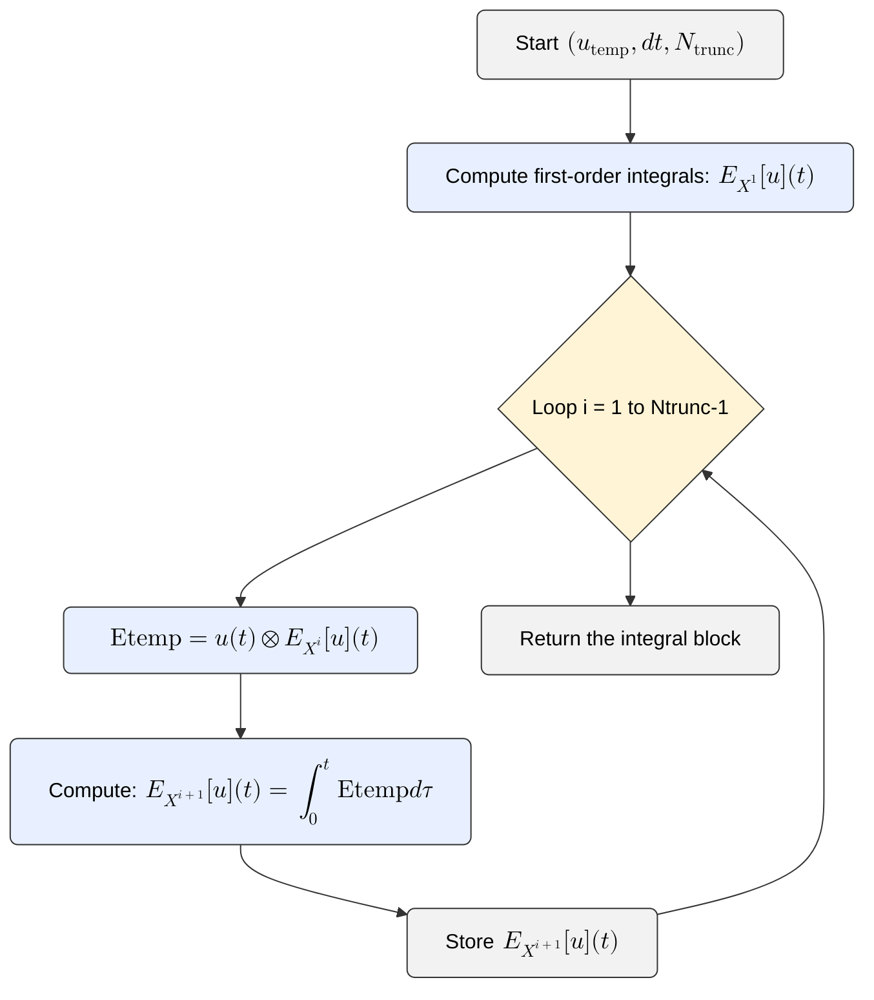
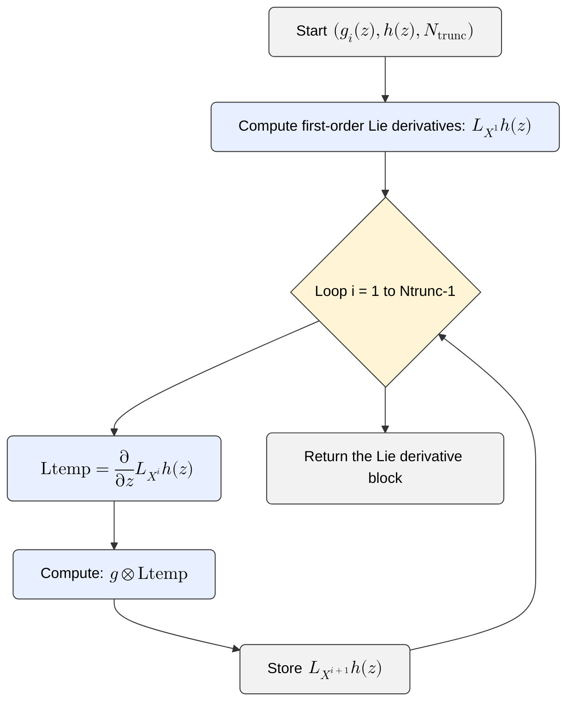

# Getting Started


This chapter provides a high-level overview of how to begin using
**CFSpy**. It introduces the core workflow, explains the
main concepts, and walks through the essential steps for computing
Chen–Fliess expansions in practice.

The goal is to give you a clear mental model first, and then guide you
through concrete examples.

## Content


- [installation](#Installation) 
- [basic usage](#Basic-usage)
- [iterated integrals](#iterated-integrals)
- [vector field](#vector-field)
- [lie derivatives](#lie-derivatives)
- [truncated series](#truncated-series)
- [ode comparison](#ode-comparison)
- [pitfalls](#pitfalls)
- [more examples](#more-examples)


## Installation


To install the **CFSpy** package, run the following command
in your terminal.

```bash
pip install --upgrade CFSpy
```

This will download and install the package along with its dependencies.
Make sure you have Python 3.12.4 or higher installed on your system.


## Basic Usage (High-Level Overview)


Once installed, **CFSpy** enables you to compute the
building blocks of the Chen–Fliess expansion:

1. **Iterated integrals** of the input  
2. **Lie derivatives** of the output along the vector fields  
3. **Chen–Fliess coefficients** $(c,\eta)$  
4. **Truncated Chen–Fliess series** $F_c^{N}[u](t)$  
5. **Comparison with the true system output**

A typical workflow looks like this:




The sections below walk through each step in detail.


## Computing iterated integrals


To compute the iterated integrals $E_\eta[u](t)$,
you must define:

- time interval $[0,t_f]$,
- input function $u(t)$,
- the integration step $dt$.
- truncation length $N$


```python
from CFS import iter_int
import numpy as np

# Time range
t0 = 0
tf = 3
dt = 0.001
t_span = (t0, tf)
t = t0:dt:tf

# inputs as arrays
u1 = sin.(t)
u2 = cos.(t)

# input array
u = np.vstack([u1, u2])

Ntrunc = 4
E = iter_int(utemp, dt, Ntrunc)
```


This computes all iterated integrals $E_\eta[u](t)$ for
$|\eta| \le N$.

The algorithm of the `iter_int` function is based on Chen's identity
which translates numerically to 

```{math}:label:eq-cfs
    \begin{aligned}
    E_{X^k}[u](t)=\int _0^t u(t)\otimes E_{X^{k-1}}[u](t) d\tau .
    \end{aligned}
```

where $u(t)$ is the matrix of inputs stacked horizontally,
$E_{X^k}[u](t)$ is the matrix that stacks horizontally the iterated integrals 
and the tensor symbol $\otimes$ represents 
the [column-wise Kronecker product](https://en.wikipedia.org/wiki/Khatri%E2%80%93Rao_product).

The outline of the calculation of the algorithm follows the workflow:




## Defining vector fields and outputs


To compute Chen–Fliess coefficients $(c,\eta) = L_\eta h$,
you must define:

- the drift vector field $g_0(z)$,
- the controlled vector fields $g_i(z)$,
- the output function $h(z)$.

Example:

```python
from CFS import iter_lie
import sympy as sp

# Define the symbolic variables
x1, x2 = sp.symbols('x1 x2')
x = sp.Matrix([x1, x2])

# Define the Lotka-Volterra system symbolically
g = sp.transpose(sp.Matrix([[-x1*x2, x1*x2], 
                            [x1, 0], 
                            [0, - x2]
                            ]))

# Define the output symbolically
h = x1
```


## Computing Lie derivatives


Lie derivatives encode the geometric structure of the system.

```python
# The truncation of the length of the words that index the Chen-Fliess series
Ntrunc = 4

# Coefficients of the Chen-Fliess series evaluated at the initial state
Ceta = np.array(iter_lie(h,g,x,Ntrunc).subs([(x[0], 1/3),(x[1], 2/3)]))
```

Similarly to the iterated integrals, the outline of the calculation of the algorithm follows the workflow:




## Computing truncated Chen–Fliess series


Once iterated integrals and Lie derivatives are available, you can
assemble the truncated Chen–Fliess series:

```python
# Chen-Fliess series
F_cu = x0[0]+np.sum(Ceta*Eu, axis = 0)
```

This returns a numerical approximation of

```{math}
F_c^{N}[u](t) = \sum_{|\eta| \le N} (c, \eta)\, E_\eta[u](t).
```


## Comparing with ODE simulation


To validate the approximation, compare it with the true system output.

```python
from scipy.integrate import solve_ivp

# Time range
t0 = 0
tf = 3
dt = 0.001
t_span = (t0, tf)

# Define the Lotka-Volterra system
def system(t, x, u1_func, u2_func):
    x1, x2 = x
    u1 = u1_func(t)
    u2 = u2_func(t)
    dx1 = -x1*x2 +  x1 * u1
    dx2 = x1*x2 - x2* u2
    return [dx1, dx2]

# Input 1
def u1_func(t):
    return np.sin(t)

# Input 2
def u2_func(t):
    return np.cos(t)

# Simulation of the system
solution = solve_ivp(system, t_span, x0, args=(u1_func, u2_func), dense_output=True)

# Partition of the time interval
t = np.linspace(t_span[0], t_span[1], int((tf-t0)//dt+1))
y = solution.sol(t)
```


## Common pitfalls


- **Mismatched dimensions**: Inputs must have shape `(m+1, length(t))`.
- **Transpose required**: Use $vcat(u0', u1', ...)$.
- **Large truncation depth**: Word count grows combinatorially.
- **Vector fields should be symbolic** for compliance.
- **Indexing inside ODE solvers** must match the time grid.


## More examples


For more detailed examples and advanced usage,
see the [examples](content/Examples.html) of the documentation.